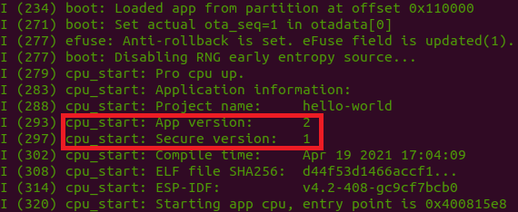

# Get Started With ESP32 OTA

## Introduction

This page is intended to guide users through the OTA procedure for the ESP32. All referenced projects come from the [ESP-IDF OTA examples directory](https://github.com/espressif/esp-idf/tree/master/examples/system/ota), with the exception of Hello World, which can be found [here](https://github.com/espressif/esp-idf/tree/master/examples/get-started/hello_world). The assumption is that you have set up ESP-IDF to version 4.* (e.g., 4.2).

The purpose of OTA is to update the firmware of an IoT device (such as ESP32) remotely and without user interaction. The ESP32 OTA mechanism supports HTTPS to securely transmit firmware over the network. The OTA mechanism can also check the security version of the firmware and compare it with the current version. Then the device may only load the new firmware if it the security version is newer than the current version — a feature known as "anti-rollback".

## Prepare the OTA Firmware Images

We are going to prepare 3 different versions of the "Hello World" firmware: 1) no version; 2) app version  without anti-rollback support; 3) app version 2 with anti-rollback support and security version 1.

### Unversioned App

Navigate to the "hello_world/" directory and run ```idf.py build```, which will build the "Hello World" binary. The binary will be generated in the "build/" directory, under the filename "hello-world.bin". To copy this image to our server directory, run ```cp build/hello-world.bin ../server/hello-world-unversioned.bin```.

### App Version 1

To specify the app version, run ```idf.py menuconfig``` and enable the option **Application Manager -> Get the project version from Kconfig**. Now a new option appears that says **Project version**, which is set to 1 by default. Leave it as is. Exit the config menu and make sure to save your changes. Re-run the build command ```idf.py build``` to incorporate these changes into the firmware. Copy this to the server directory by running ```cp build/hello-world.bin ../server/hello-world-version-1.bin```.

Optionally, you can run this firmware now to confirm that the app detects the version. Run ```idf.py flash monitor``` to upload the firmware and monitor the console output from the device. In the bootloader log, you should see the version detection, as shown below:


### App Version 2 / Security Version 1

Now we will change the app version to 2 and add the anti-rollback support, which depends on a _security version_ that is separate from the app version. Open the config menu again by running ```idf.py menuconfig```. First change the app version by setting **Application Manager -> Project version** to 2. Now go to **Bootloader config** and enable the option **Enable app rollback support**. Note that this reveals a new option, **Enable app anti-rollback support**. Make sure to enable this new option. To set the security version, set **eFuse secure version of app** to 1. Finally, make sure to enable **Emulate operations with efuse secure version(only text)**. _If you do not do this, then the anti-rollback support and secure version are saved in the hardware efuse rather than the software, and the changes will be irreversible_.

There is more to do before we leave the config. Navigate to **Partition Table -> Partition Table** and change it to "Custom partition table CS". Apps with anti-rollback support require a different partition table than the default. I have already added the required partition table in the file "partitions.csv".

Now you can exit and save the changes to the configuration. Run ```idf.py build``` to rebuild "Hello World". Copy this to the server directory by running ```cp build/hello-world.bin ../server/hello-world-version-2.bin```.

Optionally, you can run this firmware now to confirm that the app detects the version. Run ```idf.py erase_flash``` to erase the previous firmware off the chip. Then run ```idf.py flash monitor``` to upload the firmware and monitor the console output from the device. In the bootloader log, you should see both the app version and the security version, as shown below:



## Start the Web Server

## Run the simple_ota_example Project

## Run the native_ota_example Project

## Run the advanced_https_ota Project
